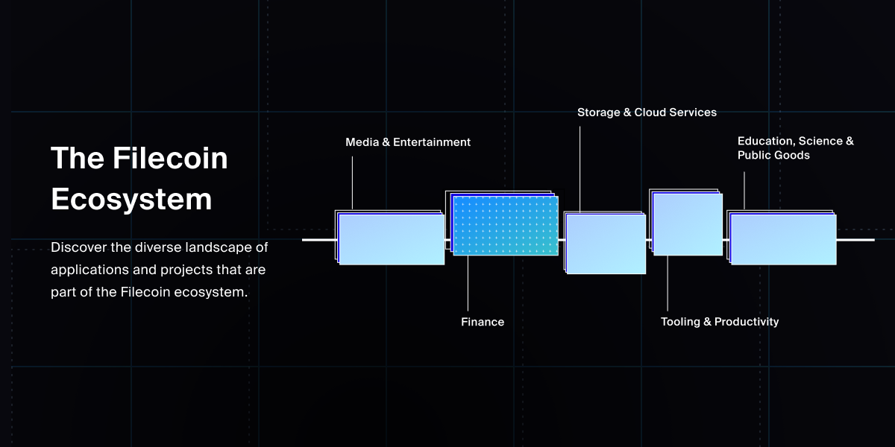

[](https://opensource.org/licenses/MIT) 

# Filecoin Ecosystem Directory

An interactive ecosystem directory and showcase, visible on [ecosystem.filecoin.io](https://ecosystem.filecoin.io)



***

## Adding or editing a project

This is a public repository, and you can add a new project or amend an existing project by submitting a pull request (PR). Your PR should contain a `json` file in `content/projects/` with your changes. This file must conform to a specific schema, otherwise one of the checks will fail.

Let's go through the steps to adding a new project. Editing a project is a simpler version of the same process, where you do not have to create a new file. 

You can follow these steps by editing directly in Github, or by cloning the repo and editing locally.

1. Create a new `json` file in `content/projects/my-project.json`, where `my-project` is the lowercase alphanumeric kebab-case name of your project (for example, a project called "Hello World Labs" would become `hello-world-labs.json`)

2. Copy the contents of the template, found in [`content/project-template.json`](content/project-template.json) (do not change this file, only copy), and add it to your file

3. Replace the content in the file with your project's data (see next section for detailed constraints and limitations)

4. Upload a sqare icon to `static/images/projects` and reference that file name in the `icon` key of your json (only the file name is needed, not the full path)

5. Create commit your changes and create a pull request against the `main` branch using the pull request template

6. If all checks pass, your PR will be reviewed by a community administrator


## Project schema

Each modified `json` file in `content/projects` runs through several CI checks: 

1. The first checks to ensure that the `json` is syntactically valid
2. The second performs more advanced checks:
  - `json` keys and values must match certain criteria (e.g., they exist, meet minimums, maximums, etc.)
  - Categories and subcategories must follow the defined taxonomy (defined in `taxonomy.json`)
  - Images are sized correctly (< 500px for raster images and 1:1 aspect ratio)

In order to pass these checks, you should be aware of the schema, and its contraints. Let's take a look at a sample data structure, pre-filled with some content.

```json
{
    "display": true,
    "since": 2023,
    "icon": "icon-myproject.png",
    "name": "My Project",
    "org": "Optional Parent Company Name",
    "description": "One to several sentences describing your project",
    "website": "//myproject.xyz",
    "social": [
        { "github": "//github.com/myproject" },
        { "twitter": "//twitter.com/myproject" }
      ],
    "taxonomy": [
      {
        "category": "finance",
        "subcategories": [ "leasing-and-staking", "exchanges-and-swaps", "infrastructure-and-other", "bridges-and-oracles" ]
      },
      {
        "category": "media-and-entertainment",
        "subcategories":  [ "arts-and-collectibles", "photo-and-video", "music", "gaming", "communication-and-social", "publishing-and-news" ]
      },
      {
        "category": "tooling-and-productivity",
        "subcategories": [ "wallets-identity-and-authentication", "network-explorers-and-reputation", "developer-tools-and-other", "privacy-and-security", "ai-productivity-and-utilities" ]
      },
      {
        "category": "storage-and-cloud-services",
        "subcategories": [ "data-storage-and-management", "data-retrieval", "compute-services", "data-curation-and-monetization", "enterprise-solutions" ]
      },
      {
        "category": "education-science-and-public-goods",
        "subcategories": [ "governance-daos-and-public-goods", "education-and-science" ]
      }
    ],
    "tags": [ "optionally", "include", "some", "tags", "like", "fvm" ]
  }
  
```

## Project validation rules

#### Global rules

There are two rules that apply globally to all the fields:

1. Written content should be in English, therefore all content fields accept only `Latin-1` characters
2. If an optional top-level field is not in use, it should still appear in the data structure, but with an empty value, such as `[]` or `""`


#### Field-specific rules

Next, let's take a look at what each key means and what values they must contain
> _* denotes a required field_

- `"display"` *
  - This is a boolean
  - Should generally be left as `true`

- `"since"` *
  - The year the project became part of the ecosystem (i.e., started using Filecoin)
  - This should be a number with no quotes, for example `2019`

- `"icon"` *
  - A small square icon, typically containing the logo of the project
  - Must match an image file uploaded to this repo in `static/images/projects/`
  - Must be one of the following file types: `.png` `.gif` `.jpg` `.jpeg` `.svg` `.webp`
  - Must be a square image, i.e., an aspect ratio of `1:1`
  - In the case of raster images, must not exceed `500px` in dimension (not applicable to SVGs)

- `"name"` *
  - The plain text name of the project
  - Should not be excessively verbose

- `"org"`
  - The parent organization or company, if one exists
  - This field is optional
    - If no org is needed, just leave the string empty like `"org": "",`

- `"description"` *
  - A short couple of sentences describing the project

- `"website"` *
  - A URL to link to the project's website
  - Must begin with a web accessible protocol: `http://`, `https://`, or just `//`

- `"social"`
  - This is an array of objects where a project's social links can be added
  - This field is optional
    - To leave it empty, just use an empty array like `social: [],`
  - Include social links by populating the array with key-value pair objects
    - Each object can be a different social link like `{ "github": "//github.com/myproject" }`

- `"taxonomy"` *
  - Select a subcategory for your project to fit into
  - Delete all the other subcategories that do not apply to your project
  - The category-subcategory pair determines where your project is grouped in the ecosystem explorer
  - Do not create any new subcategories, and do not modify top-level category names
    - The taxonomy is checked against a source of truth [`taxonomy.js`](content/data/taxonomy.js)

- `"tags"`
  - An optional array of tags
  - Tags must be short strings
  - Using the `fvm` tag adds a badge to your project

If in doubt, check out some project files here in [`content/projects`](content/projects)


## Local development quickstart

To get started developing locally

1. Clone the repo `git clone git@github.com:filecoin-project/ecosystem-directory.git`

2. Install dependencies `npm ci`

3. Run the app in development mode `npm run dev`

For more advanced developer documentation, see the [administrator docs](/docs/admin.md)

## Questions

If you have any additional questions, [open an issue](https://github.com/filecoin-project/ecodash/issues/new/choose)!
